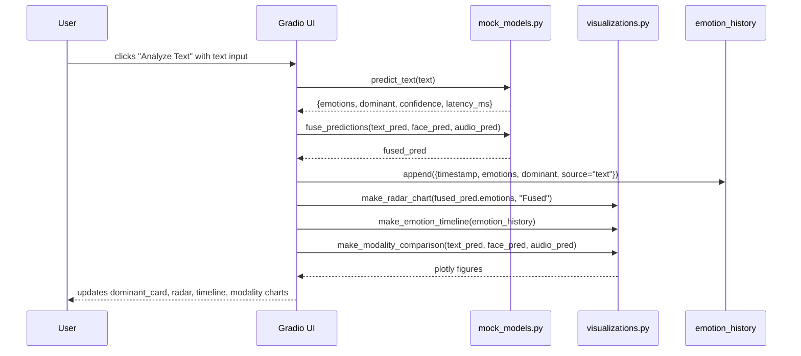
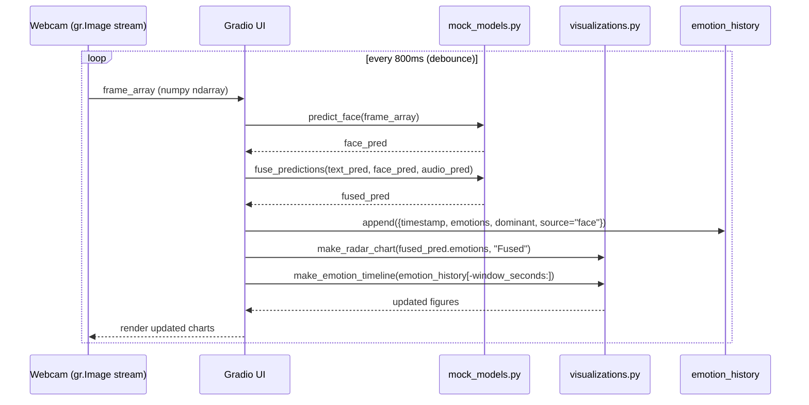
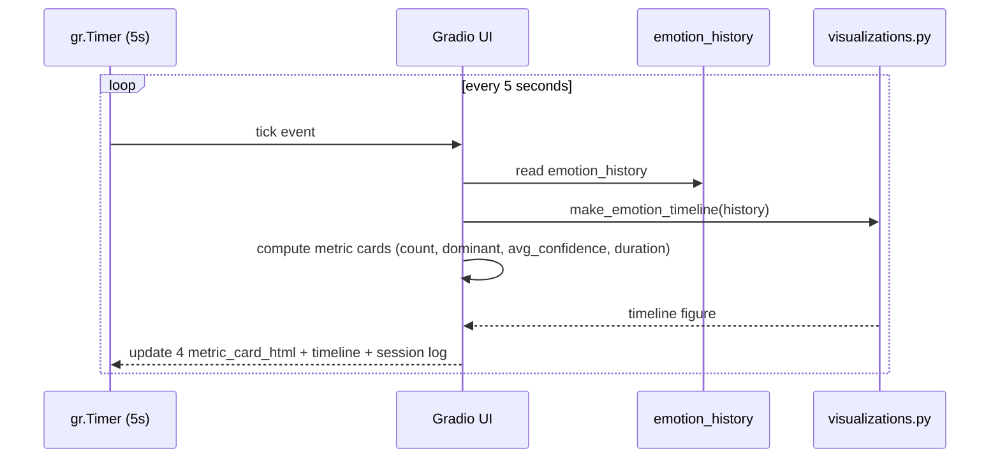

# Design Document: EchoMind Emotion AI Dashboard

## Overview

EchoMind is a multimodal emotion AI dashboard that detects and visualizes emotions from three simultaneous input channels — text, webcam (facial expression), and audio. The frontend runs entirely in DEMO MODE using mock model outputs, providing a production-quality UI built with Python 3.10+, Gradio 4.x, and Plotly 5.x. Real model integration is deferred to a later phase; all mock outputs are clearly labeled with DEMO MODE indicators.

The system captures a rolling session history of up to 120 emotion snapshots, fuses predictions via weighted late fusion, and renders live-updating charts across five tabbed views. The architecture is intentionally layered: mock models are isolated in `frontend/mock_models.py`, visualizations in `utils/visualizations.py`, reusable HTML components in `frontend/components.py`, and the Gradio app wiring in `app.py`.


## Architecture

```mermaid
graph TD
    subgraph Inputs
        TI[Text Input]
        WC[Webcam Stream]
        AU[Audio Upload/Mic]
    end

    subgraph MockModels["frontend/mock_models.py"]
        PT[predict_text]
        PF[predict_face]
        PA[predict_audio]
        FP[fuse_predictions]
    end

    subgraph Visualizations["utils/visualizations.py"]
        RC[make_radar_chart]
        CB[make_confidence_bars]
        TL[make_emotion_timeline]
        FD[make_fusion_donut]
        MC[make_modality_comparison]
    end

    subgraph Components["frontend/components.py"]
        DE[dominant_emotion_html]
        MK[metric_card_html]
        SI[status_indicator_html]
    end

    subgraph State
        EH[emotion_history: list[dict] max 120]
    end

    subgraph Tabs["app.py — Gradio Tabs"]
        T1["🎭 Live Analysis"]
        T2["📝 Deep Text Analysis"]
        T3["🎵 Audio Analysis"]
        T4["📊 Session Stats"]
        T5["ℹ️ About & Architecture"]
    end

    TI --> PT --> FP
    WC --> PF --> FP
    AU --> PA --> FP
    FP --> EH
    EH --> TL
    FP --> RC
    FP --> CB
    FP --> FD
    PT & PF & PA --> MC
    FP --> DE
    EH --> MK
    DE & MK & SI --> T1
    RC & CB & FD & MC --> T1
    RC & CB & FD --> T2
    RC & CB --> T3
    TL & MK --> T4
    T1 & T2 & T3 & T4 & T5 --> UI[Gradio UI :7860]
```


## Sequence Diagrams

### Live Analysis Tab — Text Analyze Button



### Webcam Stream — Debounced Face Analysis



### Session Stats — gr.Timer (5s interval)




## Components and Interfaces

### Component: `frontend/mock_models.py`

**Purpose**: Provides deterministic-enough mock emotion predictions for all three modalities and a weighted fusion function. Isolated so real models can replace each function independently.

**Interface**:
```python
EMOTIONS = ["joy", "sadness", "anger", "fear", "surprise", "disgust", "neutral"]

def predict_text(text: str) -> dict:
    """Keyword-biased random distribution over EMOTIONS."""
    # Returns: {emotions: dict[str, float], dominant: str, confidence: float, latency_ms: float}

def predict_face(frame_array: np.ndarray) -> dict:
    """Sine-wave drifting distribution — varies smoothly over time."""
    # Returns: {emotions: dict[str, float], dominant: str, confidence: float, latency_ms: float}

def predict_audio(audio_data: tuple[int, np.ndarray] | None) -> dict:
    """Random realistic distribution over EMOTIONS."""
    # Returns: {emotions: dict[str, float], dominant: str, confidence: float, latency_ms: float}

def fuse_predictions(
    text_pred: dict,
    face_pred: dict,
    audio_pred: dict,
    weights: tuple[float, float, float] = (0.4, 0.35, 0.25)
) -> dict:
    """Weighted late fusion — combines three modality dicts into one fused prediction."""
    # Returns: {emotions: dict[str, float], dominant: str, confidence: float, latency_ms: float}
```

**Responsibilities**:
- All functions must return the canonical prediction dict shape
- `predict_face` should use `time.time()` to drive sine-wave drift so webcam stream looks live
- `fuse_predictions` normalizes weights to sum to 1.0 even if caller passes invalid weights
- Each function logs a `[DEMO MODE]` console message on first call

---

### Component: `utils/visualizations.py`

**Purpose**: Produces Plotly figures for all chart types. All charts use the EchoMind dark theme with transparent backgrounds.

**Interface**:
```python
EMOTION_COLORS: dict[str, str] = {
    "joy": "#ffd166", "sadness": "#6b9fff", "anger": "#ff6b6b",
    "fear": "#a78bfa", "surprise": "#00d4aa", "disgust": "#86efac",
    "neutral": "#9b9bb4"
}

def make_radar_chart(emotions: dict[str, float], title: str = "") -> go.Figure:
    """Polar/radar chart. Fixed height 320px. Transparent bg."""

def make_confidence_bars(emotions: dict[str, float]) -> go.Figure:
    """Horizontal bar chart sorted descending. Fixed height 280px."""

def make_emotion_timeline(
    history: list[dict],
    window_seconds: int = 30
) -> go.Figure:
    """Line chart of dominant emotion scores over time. Fixed height 220px."""

def make_fusion_donut(fused: dict) -> go.Figure:
    """Donut chart with dominant emotion + confidence annotated at center. Fixed height 260px."""

def make_modality_comparison(
    text_pred: dict,
    face_pred: dict,
    audio_pred: dict
) -> go.Figure:
    """Grouped bar chart: 3 modalities × 7 emotions. Fixed height 240px."""
```

**Responsibilities**:
- All figures must apply `layout.paper_bgcolor = "rgba(0,0,0,0)"` and `layout.plot_bgcolor = "rgba(0,0,0,0)"`
- Font color `#e8e8f0`, gridline color `#2d2f4a`
- Each chart includes a subtle italic DEMO MODE annotation in bottom-right corner

---

### Component: `frontend/components.py`

**Purpose**: Returns raw HTML strings for dynamic Gradio `gr.HTML` blocks.

**Interface**:
```python
def dominant_emotion_html(emotion: str, confidence: float) -> str:
    """
    Large centered emotion display card.
    Shows emoji, emotion label, confidence %, color-coded by EMOTION_COLORS.
    """

def metric_card_html(label: str, value: str, color: str = "#7c6fcd") -> str:
    """
    Small stat card for Session Stats tab.
    label: e.g. 'Total Analyses'
    value: e.g. '42'
    color: accent color for the value text
    """

def status_indicator_html(detected: bool, label: str) -> str:
    """
    Animated dot + label. Green pulse when detected=True, grey when False.
    Used for text/face/audio active indicators in Live Analysis tab.
    """
```

---

### Component: `frontend/styles.css`

**Purpose**: Full dark theme stylesheet loaded via `gr.Blocks(css=...)`.

**Responsibilities**:
- CSS custom properties (variables) for the entire color palette
- `.card` — dark card container with border and hover lift
- `.metric-card` — stat card layout
- `.emotion-badge` — pill badge colored by emotion
- `.status-dot` — animated green/grey pulse indicator
- Tab accent underline for active Gradio tab
- Transparent plot backgrounds (override Gradio defaults)
- Responsive breakpoint at 768px — collapse 3-col to 1-col
- Smooth transitions on hover/active states
- Custom scrollbar (dark track, purple thumb)


## Data Models

### Prediction Dict (canonical shape — all modalities + fused)

```python
from typing import TypedDict

class PredictionResult(TypedDict):
    emotions: dict[str, float]   # keys: EMOTIONS list, values sum to ~1.0
    dominant: str                 # emotion with highest score
    confidence: float             # score of dominant emotion, 0.0–1.0
    latency_ms: float             # simulated inference latency

# Example:
# {
#   "emotions": {"joy": 0.45, "neutral": 0.20, "surprise": 0.15,
#                "sadness": 0.08, "anger": 0.05, "fear": 0.04, "disgust": 0.03},
#   "dominant": "joy",
#   "confidence": 0.45,
#   "latency_ms": 23.7
# }
```

### Emotion History Entry

```python
class HistoryEntry(TypedDict):
    timestamp: float              # time.time()
    emotions: dict[str, float]    # full distribution
    dominant: str
    source: str                   # "text" | "face" | "audio" | "fused"
```

### Global Session State

```python
# Managed as module-level list in app.py
emotion_history: list[HistoryEntry] = []   # max 120 entries (FIFO eviction)
MAX_HISTORY = 120
```

### Design System Constants

```python
DESIGN = {
    "bg": "#0f1117",
    "card": "#1a1d2e",
    "elevated": "#242740",
    "accent_purple": "#7c6fcd",
    "teal": "#00d4aa",
    "coral": "#ff6b6b",
    "amber": "#ffd166",
    "text": "#e8e8f0",
    "secondary": "#9b9bb4",
    "border": "#2d2f4a",
}

EMOTION_COLORS: dict[str, str] = {
    "joy": "#ffd166",
    "sadness": "#6b9fff",
    "anger": "#ff6b6b",
    "fear": "#a78bfa",
    "surprise": "#00d4aa",
    "disgust": "#86efac",
    "neutral": "#9b9bb4",
}

EMOTION_EMOJIS: dict[str, str] = {
    "joy": "😊", "sadness": "😢", "anger": "😠",
    "fear": "😨", "surprise": "😲", "disgust": "🤢", "neutral": "😐",
}
```


## Correctness Properties

*A property is a characteristic or behavior that should hold true across all valid executions of a system — essentially, a formal statement about what the system should do. Properties serve as the bridge between human-readable specifications and machine-verifiable correctness guarantees.*

---

### Property 1: PredictionResult Shape Completeness

*For any* call to `predict_text`, `predict_face`, `predict_audio`, or `fuse_predictions` with valid inputs, the returned PredictionResult must contain exactly the seven EMOTIONS keys (`joy`, `sadness`, `anger`, `fear`, `surprise`, `disgust`, `neutral`) in the `emotions` dict, plus `dominant`, `confidence`, and `latency_ms` fields.

**Validates: Requirements 2.1, 3.1, 4.1, 5.1**

---

### Property 2: Emotion Distribution Normalization

*For any* call to any predictor or the fuser with valid inputs, the values in the returned `emotions` dict must sum to approximately 1.0 (within ±0.01 tolerance).

**Validates: Requirements 2.2, 3.2, 4.2, 5.4**

---

### Property 3: Dominant Equals Argmax

*For any* PredictionResult returned by any predictor or `fuse_predictions`, the `dominant` field must equal the key with the highest value in the `emotions` dict.

**Validates: Requirements 2.3, 3.4, 4.3, 5.5**

---

### Property 4: Confidence Equals Dominant Score

*For any* PredictionResult returned by any predictor or `fuse_predictions`, the `confidence` field must equal `emotions[dominant]`.

**Validates: Requirements 2.4, 5.6**

---

### Property 5: Fusion Weight Normalization

*For any* non-zero weights tuple passed to `fuse_predictions`, the weights applied internally must sum to 1.0 regardless of the magnitude of the input weights.

**Validates: Requirements 5.3**

---

### Property 6: Chart Fixed Heights

*For any* emotions dict or history list passed to a visualization function, the returned Plotly Figure must have the specified fixed height: `make_radar_chart` → 320px, `make_confidence_bars` → 280px, `make_emotion_timeline` → 220px, `make_fusion_donut` → 260px, `make_modality_comparison` → 240px.

**Validates: Requirements 6.2, 7.2, 8.2, 9.3, 10.2**

---

### Property 7: Chart Transparent Backgrounds

*For any* call to any visualization function, the returned Plotly Figure must have `layout.paper_bgcolor` and `layout.plot_bgcolor` both set to `"rgba(0,0,0,0)"`.

**Validates: Requirements 6.3, 7.3, 8.4, 9.4, 10.3**

---

### Property 8: DEMO MODE Annotation Present in All Charts

*For any* call to any visualization function, the returned Plotly Figure must contain at least one layout annotation whose text includes "DEMO MODE", positioned in the bottom-right corner.

**Validates: Requirements 6.4, 7.4, 8.5, 9.5, 10.4**

---

### Property 9: Confidence Bars Sorted Descending

*For any* emotions dict passed to `make_confidence_bars`, the bar chart's y-axis categories must be ordered from the highest-scoring emotion to the lowest.

**Validates: Requirements 7.1**

---

### Property 10: Timeline Window Filtering

*For any* history list and `window_seconds` value passed to `make_emotion_timeline`, all data points rendered in the figure must have timestamps within the last `window_seconds` seconds relative to the most recent entry.

**Validates: Requirements 8.3**

---

### Property 11: Fusion Donut Center Annotation

*For any* PredictionResult passed to `make_fusion_donut`, the figure's center annotation must contain the `dominant` emotion label and the `confidence` value formatted as a percentage.

**Validates: Requirements 9.2**

---

### Property 12: Modality Comparison Has Three Traces

*For any* three PredictionResult dicts passed to `make_modality_comparison`, the returned Plotly Figure must contain exactly three bar traces (one per modality: text, face, audio), each covering all seven emotions.

**Validates: Requirements 10.1**

---

### Property 13: Dominant Emotion HTML Content

*For any* valid `(emotion, confidence)` pair passed to `dominant_emotion_html`, the returned HTML string must contain the corresponding emoji from `EMOTION_EMOJIS`, the emotion label, the confidence formatted as a percentage, and the color from `EMOTION_COLORS` for that emotion.

**Validates: Requirements 11.1, 11.2**

---

### Property 14: Metric Card HTML Content

*For any* `(label, value)` pair passed to `metric_card_html`, the returned HTML string must contain both the label text and the value text. When no color is provided, the accent color `#7c6fcd` must appear in the HTML.

**Validates: Requirements 12.1, 12.2**

---

### Property 15: Status Indicator Reflects Detected State

*For any* label string, `status_indicator_html(detected=True, label)` must return HTML containing a green indicator, and `status_indicator_html(detected=False, label)` must return HTML containing a grey indicator.

**Validates: Requirements 13.1, 13.2**

---

### Property 16: History Capacity and FIFO Eviction

*For any* sequence of `append` operations on `emotion_history`, the list length must never exceed 120. When a 121st entry is added, the entry that was at index 0 before the append must no longer be present, and the new entry must be at the last position.

**Validates: Requirements 15.1, 15.2**

---

### Property 17: HistoryEntry Field Completeness

*For any* analysis operation (text, face, or audio), the HistoryEntry appended to `emotion_history` must contain non-null values for `timestamp`, `emotions`, `dominant`, and `source` fields.

**Validates: Requirements 15.3**
